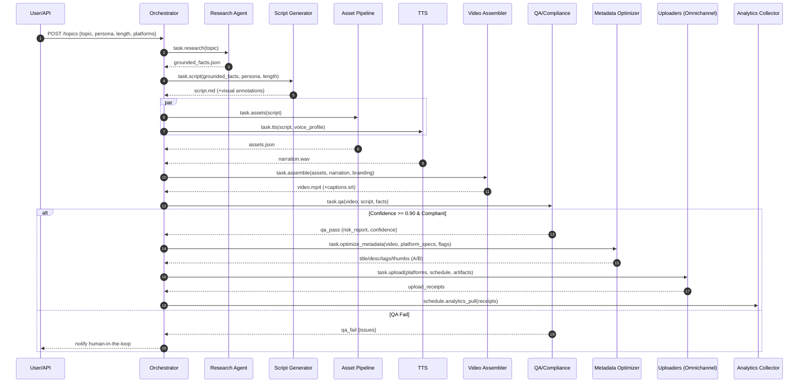

# AI Omnichannel Automated Content System
## High‑Level Technical Fixes & Complete Unified Implementation Plan (v0.1)

> **Master file:** `AI_Youtube_BusinessPlan_Hierarchical.md` (this document)  
> **Goal:** Fix known issues, remove duplication, and unify every moving part into a single, cohesive, plug‑and‑play content automation system spanning research → script → assets → TTS → assembly → QA/compliance → upload → analytics/feedback.

---

## 1) Executive Summary

We will:
1. **Normalize the codebase** behind a single **Event‑Driven Orchestrator** and a shared library of modules.
2. **Eliminate duplication** in “content systems” and “omnichannel” logic by extracting stable interfaces and **platform adapters**.
3. **Enforce a universal QA & Compliance Gate** (≥0.90 confidence threshold) as the sole gateway to upload.
4. **Replace blocking waits** with a reliable **task queue** and scheduled jobs (Celery + Redis).
5. **Introduce feature flags** for experimental growth tactics (e.g., aggressive hashtags, hype titles) with **OFF-by-default** prod settings.
6. **Create a single source of truth** for **Platform Specs** (durations, aspect ratios, title/desc limits, caption/hashtag constraints, upload scopes).
7. **Complete observability**: health checks, structured logs, metrics, and daily/weekly reports.
8. **Omnichannel first-class**: unified scheduling, uploaders, analytics ingestion, and a continuous improvement loop.

---

## 2) Scope & Non‑Goals

**In‑scope**: All services required to autonomously produce, validate, publish, and learn from content across YouTube, TikTok, Facebook, and future platforms.  
**Out‑of‑scope** (for now): Support for custom live streams, real‑time Twitch events, or editorial collaboration tooling beyond the minimal human‑in‑the‑loop review at QA gate.

---

## 3) Architecture (Target)

**Pattern:** Event‑Driven micro‑modular system with a central **Orchestrator** and a **Task Queue**.  
**Core services (modules)**:
- **Topic Intake** → **Research Agent** → **Grounded Facts Store**
- **Script Generator** (structured Markdown with visual annotations)
- **Asset Pipeline** (stock images/video, b‑roll selection/generation, licensing validation)
- **TTS Service** (multi‑voice profiles)
- **Video Assembly** (FFmpeg/MoviePy + Branding Intro/Outro + Captions + Loudness)
- **QA & Compliance Gate** (facts verification, copyright risk, policy check, confidence score)
- **Metadata Optimizer** (titles, desc, tags, thumbnails, A/B variants) **(feature‑flagged experiments)**
- **Omnichannel Uploaders** (platform adapters + scheduler + retrier)
- **Analytics Collector** (views, CTR, watch‑through, platform‑specific KPIs)
- **Feedback Loop** (analytics → optimizer → scheduler)
- **Observability** (logs, metrics, health, daily status reports)

**Data plane:** S3‑compatible object store (assets/renders), Postgres (jobs/config/analytics), Redis (queue/cache), MinIO (optional local S3).

**Control plane:** Celery workers (per module), Orchestrator/API (FastAPI), Admin UI (optional).



---

## 4) Fixes Required (Actionable)

### Critical
1. **Module import mismatch**
   - **Problem:** `complete_example.py` imports `content_system`, but the implementation file is named `automated_content_system.py` / duplicated in `enhanced_content_system.py`.
   - **Fix:** Choose canonical name `content_system.py`. Rename files or update import call sites accordingly.
   - **Acceptance:** `python -m content_system` initializes with no ImportError; `complete_example.py` runs end‑to‑end.

2. **Duplicate Content Systems**
   - **Problem:** Two parallel implementations (minimal vs enhanced) cause drift.
   - **Fix:** Merge into **one** `content_system` package with submodules:
     - `content_system/research.py`
     - `content_system/script.py`
     - `content_system/assets.py`
     - `content_system/tts.py`
     - `content_system/assembly.py`
     - `content_system/qa.py`
     - `content_system/metadata.py`
     - `content_system/uploaders/` (YouTube, TikTok, Facebook)
     - `content_system/platform_specs.py`
     - `content_system/analytics.py`
     - `content_system/experiments.py`
     - `content_system/orchestrator.py` (FastAPI + Celery entry)
   - **Acceptance:** Single import path; no duplicated logic across modules.

3. **Blocking waits in async paths**
   - **Problem:** `time.sleep` in A/B switching or upload pollers blocks workers.
   - **Fix:** Replace with Celery **scheduled tasks** (ETA/countdown) or cron via **Celery Beat**. Use Redis as the broker + result backend.
   - **Acceptance:** Profiling shows no blocking I/O; horizontal scaling adds linear throughput.

4. **Universal QA/Compliance Gate**
   - **Problem:** Not all flows call the same gate; drift in checks/thresholds.
   - **Fix:** Create `qa.evaluate(run_id, artifacts)` API returning `{confidence, issues[], copyright_risk, policy_flags}`. Enforce **≥0.90** threshold. Block uploads until pass.
   - **Acceptance:** System rejects non‑compliant videos automatically; audit log shows gate decision per run.

### High
5. **Single Source of Truth for Platform Specs**
   - **Fix:** Implement `PlatformSpecsManager` with JSON/YAML source; exposed via `platform_specs.get(platform, key)`. Includes video limits, title/desc lengths, aspect, caption/hashtag bounds, rate limits.
   - **Acceptance:** All uploaders and optimizer read from the same manager; unit tests cover major platforms.

6. **Feature Flags for Experiments**
   - **Fix:** Add `experiments.py` with toggles (`ExperimentConfig`). Default OFF in prod. Include `HypeTitles`, `HashtagPad`, `AggressiveThumbs`, `RapidABSwap`.
   - **Acceptance:** Flags can be toggled per‑environment without code changes; config audited.

7. **Observability & Health**
   - **Fix:** Structured logging (JSON), metrics (Prometheus), health endpoints (`/healthz`, `/readyz`), daily email/slack reports, error tracing (OpenTelemetry).
   - **Acceptance:** Dashboards show per‑module throughput, errors, latencies; alerts on SLA breaches.

### Medium
8. **Config Normalization & Secrets**
   - **Fix:** `/config/*.yaml` + env vars for secrets (12‑factor). Sample `.env.example`. Do not hardcode API keys.
9. **Omnichannel Scheduler**
   - **Fix:** One scheduler that understands platform time windows and analytics feedback. CRON/Beat tasks to schedule/publish.
10. **Asset Licensing Validator**
   - **Fix:** Enforce CC/public‑domain check; store license metadata alongside assets.

---

## 5) Unified Repository Layout

```
repo/
  content_system/
    __init__.py
    orchestrator.py         # FastAPI + task dispatch
    research.py             # web search + extractors + sources
    script.py               # fact-grounded script builder
    assets.py               # image/video/music selection/generation
    tts.py                  # voice synthesis interface
    assembly.py             # ffmpeg/moviepy, captions, branding
    qa.py                   # facts verify, policy/copyright, confidence
    metadata.py             # titles, descriptions, tags, thumbnails (A/B)
    experiments.py          # feature flags
    platform_specs.py       # centralized rules
    uploaders/
      __init__.py
      youtube.py
      tiktok.py
      facebook.py
    analytics.py            # KPIs ingestion + storage
    storage.py              # S3/MinIO helpers
    models.py               # pydantic models & schemas
  config/
    platform_specs.yaml
    experiments.yaml
    branding.yaml
    orchestrator.yaml
  infra/
    docker-compose.yml
    Dockerfile.worker
    Dockerfile.api
    k8s/ (optional manifests)
  tests/
    test_platform_specs.py
    test_qa_gate.py
    test_uploaders.py
    test_end_to_end.py
  scripts/
    run_local.sh
    seed_demo.sh
  README.md
  AI_Youtube_BusinessPlan_Hierarchical.md  # this file
```

---

## 6) Interfaces (Stable Contracts)

### 6.1 Pydantic Models (Examples)

```python
# models.py (sketch)
from pydantic import BaseModel, HttpUrl, Field
from typing import List, Dict, Optional

class TopicRequest(BaseModel):
    topic: str
    persona: str = "neutral"
    length: str = "short"  # short | medium | long
    platforms: List[str] = ["youtube"]
    schedule_at: Optional[str] = None  # ISO8601

class GroundedFact(BaseModel):
    claim: str
    sources: List[HttpUrl]

class GroundedFacts(BaseModel):
    items: List[GroundedFact]

class ScriptSegment(BaseModel):
    text: str
    cue: Optional[str] = None  # e.g., "[b-roll: skyline]", "[pause]"

class ScriptDoc(BaseModel):
    segments: List[ScriptSegment]

class QAResult(BaseModel):
    confidence: float
    issues: List[str] = []
    rights_ok: bool = True
    policy_flags: List[str] = []
```

### 6.2 Orchestrator Task Signatures

```python
# orchestrator.py (sketch)
def task_research(req: TopicRequest) -> GroundedFacts: ...
def task_script(facts: GroundedFacts, persona: str, length: str) -> ScriptDoc: ...
def task_assets(script: ScriptDoc) -> dict: ...
def task_tts(script: ScriptDoc, voice_profile: str) -> str:  # returns path to WAV
def task_assemble(assets: dict, narration_wav: str, branding_cfg: dict) -> dict:  # {video, captions}
def task_qa(run_id: str, artifacts: dict) -> QAResult: ...
def task_optimize_metadata(artifacts: dict, platforms: list, flags: dict) -> dict: ...
def task_upload(artifacts: dict, metadata_by_platform: dict, schedule_at: str|None) -> dict: ...
def task_collect_analytics(upload_receipts: dict) -> dict: ...
```

---

## 7) Config Examples

### 7.1 Platform Specs (`config/platform_specs.yaml`)

```yaml
youtube:
  max_duration_sec: 21600
  aspect_ratios: ["16:9", "9:16", "1:1"]
  title_max: 100
  desc_max: 5000
  hashtag_max: 15
  upload_rate_limit_per_min: 5

tiktok:
  max_duration_sec: 600
  aspect_ratios: ["9:16"]
  title_max: 2200
  hashtag_max: 30

facebook:
  max_duration_sec: 7200
  aspect_ratios: ["16:9", "9:16", "1:1"]
  title_max: 255
  desc_max: 63206
```

### 7.2 Experiments (`config/experiments.yaml`)

```yaml
prod:
  HypeTitles: false
  HashtagPad: false
  AggressiveThumbs: false
  RapidABSwap: false

staging:
  HypeTitles: true
  HashtagPad: true
  AggressiveThumbs: true
  RapidABSwap: true
```

---

## 8) QA & Compliance Gate (Spec)

- **Inputs:** `script.md`, `grounded_facts.json`, `video.mp4`, `captions.srt`, `assets.json (with license metadata)`  
- **Checks:**
  - **Fact verification:** each claim backed by ≥2 independent sources
  - **Policy compliance:** platform policy heuristics (hate/violence/medical/etc)
  - **Copyright & licensing:** CC/PD only; validate asset metadata
  - **Confidence score:** aggregate heuristic → **must be ≥ 0.90**
- **Outputs:** `QAResult` (confidence, issues, rights_ok, policy_flags)
- **Behavior:** If **fail**, stop pipeline and notify human reviewer; if **pass**, continue to metadata & upload.

---

## 9) Omnichannel Orchestration

- **Scheduling:** Global job decides publish times per platform (time‑zone aware, embargo windows).  
- **Adapters:** `uploaders/{platform}.py` implement `prepare()`, `upload()`, `schedule()`, `retry()` with **exponential backoff**.
- **Analytics:** Pull at defined intervals; normalize into `analytics.events` table.
- **Feedback Loop:** Update metadata models/weights; re‑run `task_optimize_metadata` for future content.

---

## 10) Deployment (Local → Staging → Prod)

### 10.1 Docker Compose (local)

```yaml
version: "3.9"
services:
  api:
    build: { context: ., dockerfile: infra/Dockerfile.api }
    env_file: .env
    ports: ["8000:8000"]
    depends_on: [redis, db]
  worker:
    build: { context: ., dockerfile: infra/Dockerfile.worker }
    env_file: .env
    depends_on: [redis, db]
    command: ["celery", "-A", "content_system.orchestrator", "worker", "-l", "INFO"]
  beat:
    build: { context: ., dockerfile: infra/Dockerfile.worker }
    env_file: .env
    depends_on: [redis, db]
    command: ["celery", "-A", "content_system.orchestrator", "beat", "-l", "INFO"]
  redis:
    image: redis:7
  db:
    image: postgres:16
    environment:
      POSTGRES_PASSWORD: example
  minio:
    image: minio/minio
    command: server /data --console-address ":9001"
    ports: ["9000:9000","9001:9001"]
```

### 10.2 Environment

```
# .env (example)
REDIS_URL=redis://redis:6379/0
DATABASE_URL=postgresql://postgres:example@db:5432/postgres
S3_ENDPOINT=http://minio:9000
S3_ACCESS_KEY=localdev
S3_SECRET_KEY=localdevsecret
YOUTUBE_API_KEY=...
TIKTOK_TOKEN=...
FACEBOOK_TOKEN=...
ENV=staging
```

---

## 11) Migration & Implementation Plan

### Phase A — Normalize & Compile
1. **Rename/merge modules** into `content_system` package.
2. **Update imports** in all entry points (e.g., `complete_example.py`).
3. **Create `platform_specs.py`** + `config/platform_specs.yaml` and route all reads through it.
4. **Introduce `experiments.py`** + `config/experiments.yaml`.
5. **Implement QA Gate** as a single callable consumed by all flows.
6. **Replace blocking waits** with **Celery Beat** schedules.
7. **Add structured logging** and health endpoints.

### Phase B — Uploaders & Scheduler Unification
1. Extract **uploaders** into `content_system/uploaders/` adhering to a shared interface.
2. Build **Omnichannel Scheduler** (Beat jobs) with platform windows and staggered releases.
3. Add **retry** and **exponential back‑off** in all uploaders.

### Phase C — Analytics & Feedback
1. Implement `analytics.py` to ingest platform KPIs.
2. Daily cron to **pull analytics**; persist normalized records.
3. Implement **feedback loop** that adjusts optimizer parameters.

**Definition of Done:**  
- Single `make run` brings up API, workers, Beat.  
- `POST /topics` executes E2E with QA gate and scheduled upload.  
- Observability dashboards healthy; test suite green.

---

## 12) Testing Strategy

- **Unit:** platform specs, QA scoring, upload retry logic.  
- **Integration:** E2E pipeline on sample topic (YouTube only), then YouTube+TikTok.  
- **Contract tests:** JSON schema validation on module I/O.  
- **Chaos tests:** network flakiness on uploaders, asset source timeouts.  
- **Performance:** concurrent topics across workers; ensure linear scalability.

---

## 13) Runbook (Ops Quickstart)

1. **Start stack:** `docker compose up -d`  
2. **Submit topic:** `curl -X POST :8000/topics -d '{"topic":"Deep Sea Facts","platforms":["youtube","tiktok"]}'`  
3. **Monitor:** `/healthz`, Celery Flower (optional), logs.  
4. **Review QA fails:** Check `qa_reports/` in S3; resolve issues; re‑queue job.  
5. **Verify uploads:** uploader receipts; platform dashboards.  
6. **Analytics:** Inspect daily metrics; confirm feedback loop jobs ran.

---

## 14) Security & Compliance

- Store secrets only in **env vars** / secret managers.  
- Log **no PII**; redact tokens.  
- Track 3rd‑party asset licenses; keep manifest with every render.  
- Follow platform ToS; rate‑limit calls; audit access.

---

## 15) Roadmap (Next)

- Multi‑voice casting & localization pipeline.  
- Thumbnail generator with branded templates + promptable styles.  
- Policy‑aware topic classifier to route risky topics to human review by default.  
- Auto‑chaptering & timestamps; YouTube Shorts variants generator.

---

## 16) Checklists

### Developer
- [ ] `content_system` package created; imports updated.
- [ ] QA gate in place; threshold ≥ 0.90.
- [ ] Platform specs centralized; tests pass.
- [ ] Experiments behind flags; prod OFF.
- [ ] Celery workers + Beat running; no blocking calls.
- [ ] Uploaders implement shared interface + retries.
- [ ] Observability dashboards online.

### Ops
- [ ] Env and secrets configured.
- [ ] S3/MinIO buckets provisioned.
- [ ] CI runs tests; blocks merge on red.
- [ ] Daily status & analytics reports delivered.

---

**End of master plan.**
