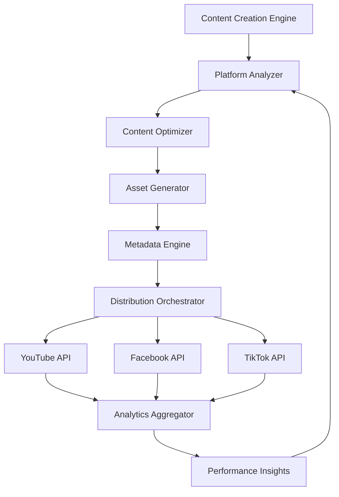

# 🌐 Omnichannel Content Distribution Framework
*Connecting Content Creation Engine to Multi-Platform Distribution*

## 🏗️ **Architecture Overview**

### Core Flow: Single Content → Multi-Platform Optimization → Synchronized Distribution



## 📱 **Platform-Specific Optimizations**

### YouTube Shorts
```python
YOUTUBE_SPECS = {
    "aspect_ratio": "9:16",
    "duration": "15-60 seconds",
    "resolution": "1080x1920",
    "format": "mp4",
    "max_file_size": "15GB",
    "engagement_focus": "retention_rate",
    "algorithm_factors": ["watch_time", "ctr", "engagement"],
    "optimal_upload_times": ["2-4 PM EST", "6-9 PM EST"],
    "hashtags_limit": 15,
    "title_limit": 100
}
```

### TikTok
```python
TIKTOK_SPECS = {
    "aspect_ratio": "9:16", 
    "duration": "15-300 seconds",
    "resolution": "1080x1920",
    "format": "mp4",
    "max_file_size": "287MB",
    "engagement_focus": "completion_rate",
    "algorithm_factors": ["completion_rate", "shares", "comments"],
    "optimal_upload_times": ["6-10 AM EST", "7-9 PM EST"],
    "hashtags_limit": 150,
    "trending_hashtags_required": True
}
```

### Facebook Reels
```python
FACEBOOK_SPECS = {
    "aspect_ratio": "9:16",
    "duration": "15-90 seconds", 
    "resolution": "1080x1920",
    "format": "mp4",
    "max_file_size": "4GB",
    "engagement_focus": "meaningful_interactions",
    "algorithm_factors": ["shares", "comments", "saves"],
    "optimal_upload_times": ["1-3 PM EST", "6-9 PM EST"],
    "hashtags_limit": 30,
    "cross_posting": True
}
```

## 🎯 **Content Adaptation Strategy**

### 1. Universal Content Core
```python
class UniversalContent:
    def __init__(self, research_data, script):
        self.core_message = research_data['key_message']
        self.educational_facts = research_data['verified_facts']
        self.visual_assets = research_data['images']
        self.base_script = script
        self.target_audience = research_data['audience_segment']
        self.niche_category = research_data['niche']
```

### 2. Platform-Specific Adaptations

#### YouTube Strategy: Authority & Education
```python
def adapt_for_youtube(universal_content):
    return {
        "hook_style": "question_statistic_promise",
        "script_tone": "educational_authoritative", 
        "visual_style": "professional_branded",
        "cta": "subscribe_for_more_learning",
        "metadata_focus": "SEO_keywords",
        "monetization": "ads_enabled",
        "community_features": "comments_enabled"
    }
```

#### TikTok Strategy: Viral & Engaging  
```python
def adapt_for_tiktok(universal_content):
    return {
        "hook_style": "pattern_interrupt_trending",
        "script_tone": "casual_relatable",
        "visual_style": "dynamic_quick_cuts", 
        "cta": "follow_for_daily_facts",
        "metadata_focus": "trending_hashtags",
        "engagement_hack": "comment_bait_question",
        "trend_integration": True
    }
```

#### Facebook Strategy: Social & Shareable
```python
def adapt_for_facebook(universal_content):
    return {
        "hook_style": "emotional_connection",
        "script_tone": "conversational_warm",
        "visual_style": "story_driven",
        "cta": "share_with_friends",
        "metadata_focus": "social_keywords", 
        "community_features": "discussion_starter",
        "shareability_factor": "high"
    }
```

## 🔄 **Intelligent Distribution Orchestrator**

### Content Processing Pipeline
```python
class OmnichannelOrchestrator:
    def __init__(self):
        self.platforms = ['youtube', 'tiktok', 'facebook']
        self.content_queue = {}
        self.rate_limiters = self._setup_rate_limiters()
        self.performance_tracker = CrossPlatformAnalytics()
    
    async def process_content(self, universal_content):
        """Main orchestration flow"""
        
        # 1. Generate platform-specific versions
        platform_versions = await self._create_platform_versions(universal_content)
        
        # 2. Optimize metadata for each platform
        optimized_metadata = await self._optimize_metadata(platform_versions)
        
        # 3. Schedule strategic distribution
        distribution_schedule = await self._create_distribution_schedule(optimized_metadata)
        
        # 4. Execute synchronized uploads
        upload_results = await self._execute_uploads(distribution_schedule)
        
        # 5. Monitor cross-platform performance
        await self._track_performance(upload_results)
        
        return upload_results
```

### Smart Scheduling System
```python
class SmartScheduler:
    def __init__(self):
        self.optimal_times = {
            'youtube': ['14:00', '18:00', '20:00'],  # 2PM, 6PM, 8PM EST
            'tiktok': ['06:00', '10:00', '19:00'],   # 6AM, 10AM, 7PM EST  
            'facebook': ['13:00', '15:00', '18:00'] # 1PM, 3PM, 6PM EST
        }
        self.timezone = 'US/Eastern'
    
    def calculate_optimal_schedule(self, content_priority='balanced'):
        """Calculate staggered posting times for maximum reach"""
        
        if content_priority == 'viral_first':
            # Post to TikTok first for viral potential
            return {
                'tiktok': 'immediate',
                'facebook': '+2 hours', 
                'youtube': '+4 hours'
            }
        elif content_priority == 'authority_first':
            # Post to YouTube first for SEO benefit
            return {
                'youtube': 'immediate',
                'facebook': '+1 hour',
                'tiktok': '+3 hours' 
            }
        else:
            # Balanced approach
            return {
                'youtube': 'immediate',
                'tiktok': '+1 hour',
                'facebook': '+2 hours'
            }
```

## 📊 **Cross-Platform Analytics & Optimization**

### Unified Performance Tracking
```python
class CrossPlatformAnalytics:
    def __init__(self):
        self.metrics_aggregator = MetricsAggregator()
        self.performance_predictor = MLPerformancePredictor()
    
    async def analyze_content_performance(self, content_id):
        """Analyze performance across all platforms"""
        
        performance_data = {
            'youtube': await self._get_youtube_metrics(content_id),
            'tiktok': await self._get_tiktok_metrics(content_id),  
            'facebook': await self._get_facebook_metrics(content_id)
        }
        
        insights = {
            'best_performing_platform': self._identify_top_performer(performance_data),
            'audience_overlap': self._calculate_audience_overlap(performance_data),
            'optimization_opportunities': self._find_optimization_opportunities(performance_data),
            'cross_platform_synergies': self._identify_synergies(performance_data)
        }
        
        return {
            'raw_data': performance_data,
            'insights': insights,
            'recommendations': self._generate_recommendations(insights)
        }
```

### Performance Optimization Loop
```python
class PerformanceOptimizer:
    def __init__(self):
        self.a_b_tester = CrossPlatformABTester()
        self.content_variations = ContentVariationGenerator()
    
    async def optimize_content_strategy(self, performance_history):
        """Continuously optimize based on cross-platform learnings"""
        
        # Identify winning patterns
        winning_patterns = self._extract_winning_patterns(performance_history)
        
        # Generate improved variations
        optimized_strategies = {
            'youtube': self._optimize_youtube_strategy(winning_patterns),
            'tiktok': self._optimize_tiktok_strategy(winning_patterns),
            'facebook': self._optimize_facebook_strategy(winning_patterns)
        }
        
        return optimized_strategies
```

## 🎨 **Creative Asset Management**

### Dynamic Asset Generation
```python
class OmnichannelAssetGenerator:
    def __init__(self):
        self.image_optimizer = MultiPlatformImageOptimizer()
        self.video_processor = AdaptiveVideoProcessor()
        self.thumbnail_generator = SmartThumbnailGenerator()
    
    async def generate_platform_assets(self, base_content, platform_specs):
        """Generate optimized assets for each platform"""
        
        assets = {}
        
        for platform, specs in platform_specs.items():
            assets[platform] = {
                'video': await self._optimize_video(base_content.video, specs),
                'thumbnail': await self._generate_thumbnail(base_content, platform),
                'captions': await self._adapt_captions(base_content.captions, specs),
                'cover_image': await self._create_cover_image(base_content, platform)
            }
        
        return assets
```

### Brand Consistency Engine
```python
class BrandConsistencyEngine:
    def __init__(self, brand_guidelines):
        self.brand_colors = brand_guidelines['colors']
        self.brand_fonts = brand_guidelines['fonts'] 
        self.brand_voice = brand_guidelines['voice']
        self.brand_elements = brand_guidelines['visual_elements']
    
    def ensure_brand_consistency(self, platform_content):
        """Maintain brand consistency across platforms while adapting to platform culture"""
        
        return {
            'visual_branding': self._adapt_visual_branding(platform_content),
            'voice_adaptation': self._adapt_brand_voice(platform_content),
            'logo_placement': self._optimize_logo_placement(platform_content),
            'color_scheme': self._apply_brand_colors(platform_content)
        }
```

## 🚀 **Implementation Roadmap**

### Phase 1: Foundation (Week 1-2)
- [ ] Set up unified content processing pipeline
- [ ] Implement platform-specific optimization engines  
- [ ] Create basic scheduling system
- [ ] Test individual platform uploads

### Phase 2: Integration (Week 3-4)
- [ ] Build orchestration system
- [ ] Implement cross-platform analytics
- [ ] Create performance tracking dashboard
- [ ] Add A/B testing capabilities

### Phase 3: Optimization (Week 5-6)
- [ ] Deploy ML performance predictor
- [ ] Implement smart scheduling
- [ ] Add trend detection system
- [ ] Build optimization feedback loops

### Phase 4: Scale (Week 7-8)
- [ ] Add advanced asset generation
- [ ] Implement audience segmentation
- [ ] Create automated optimization
- [ ] Build comprehensive reporting

## 💡 **Key Success Strategies**

### 1. Platform-Native Content
- **YouTube**: Focus on education and authority
- **TikTok**: Embrace trends and entertainment  
- **Facebook**: Prioritize social sharing and discussion

### 2. Strategic Content Sequencing
- Use TikTok for trend discovery
- Leverage Facebook for community building
- Build authority and SEO through YouTube

### 3. Cross-Platform Audience Funneling
- TikTok → Instagram → YouTube subscriber funnel
- Facebook groups → YouTube community building
- Cross-platform content series and storytelling

### 4. Data-Driven Decision Making
- Track performance across all platforms
- Identify content that performs well on multiple platforms
- Optimize based on cross-platform insights
- Use A/B testing to refine strategies

This omnichannel framework ensures your content creation engine can efficiently distribute optimized content across all three major platforms while maintaining brand consistency and maximizing engagement on each platform's unique algorithm and audience preferences.