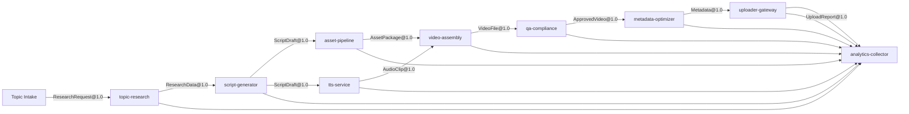

# Service Boundaries and Event Flows

The following diagram illustrates the event-driven architecture for the content system. Solid arrows denote asynchronous events transmitted via Redis (or NATS). Synchronous HTTP calls are labeled accordingly.

All services expose `GET /healthz` for liveness checks. The orchestrator interacts with each service via HTTP for control actions (e.g., `POST /topics`) while publishing and subscribing to the events shown above.
