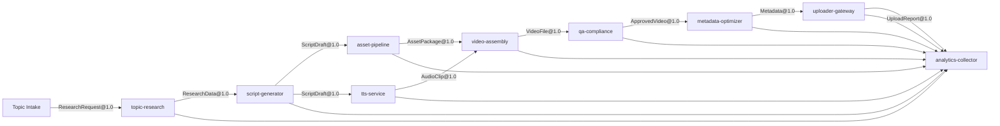

# Service Boundaries and Events

The diagram below illustrates service boundaries, data flows and event channels in the content system.

Interactions between services use asynchronous events over Redis/NATS. Synchronous interactions, such as topic submission or analytics retrieval, are exposed via HTTP APIs defined with OpenAPI.

